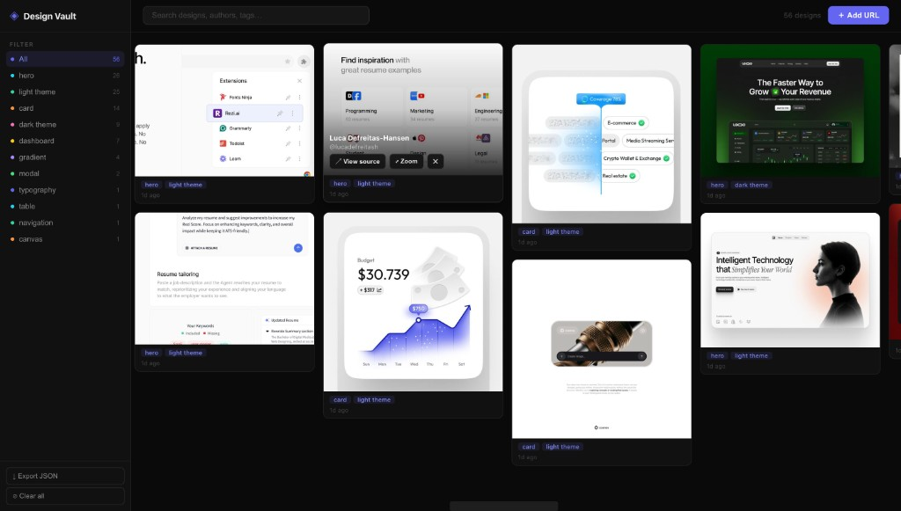

# Design Vault

A Chrome extension that lets you save design inspiration from Twitter/X (and any website) into a personal, searchable moodboard.

## Features

- **Save from Twitter/X** — hover over any image in your feed and click the `+ Save` button that appears
- **Save from anywhere** — right-click any image on the web and select "Save to Design Vault"
- **Add by URL** — paste a Dribbble, Behance, or any link and it auto-fetches the OG image
- **Tag & organize** — add preset or custom tags when saving (dashboard, card, hero, dark theme, etc.)
- **Full moodboard gallery** — masonry grid with sidebar filters, search, and a lightbox viewer
- **Drag & drop reorder** — arrange your saved designs however you like
- **Export** — download your entire collection as JSON
- **Zero dependencies** — pure vanilla JS, no build step, no frameworks

## Install

1. Clone this repo
2. Open `chrome://extensions` in Chrome
3. Enable **Developer mode** (toggle in the top right)
4. Click **Load unpacked** and select the project folder

## How it works

| Component | What it does |
|---|---|
| `content.js` | Injects a save button on Twitter/X image hovers, opens a tagging dialog |
| `background.js` | Handles the right-click context menu, OG meta fetching for Add URL |
| `popup/` | Quick-access popup showing saved designs with search and filters |
| `gallery/` | Full-page moodboard with masonry layout, sidebar, lightbox, drag-and-drop |

## License

MIT
